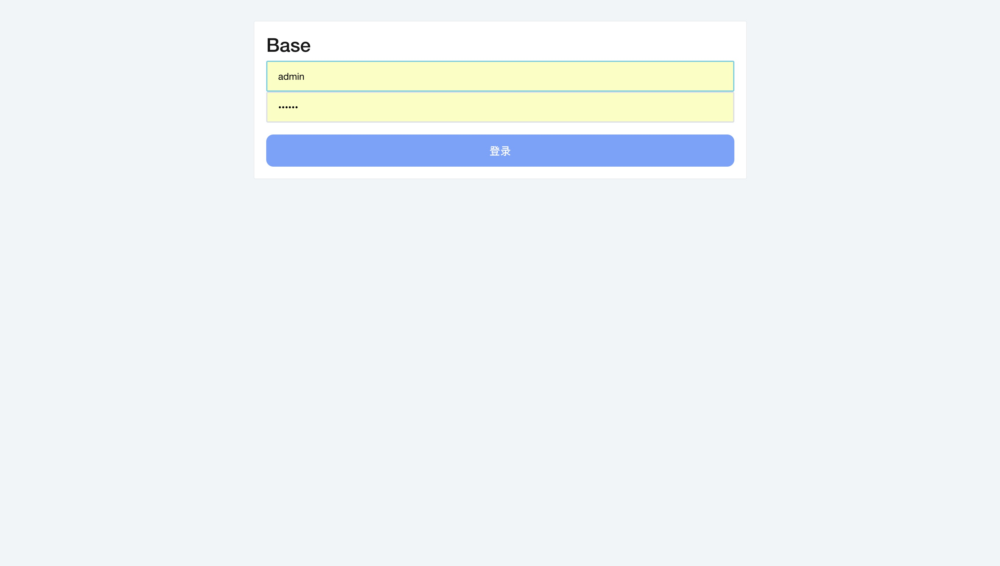
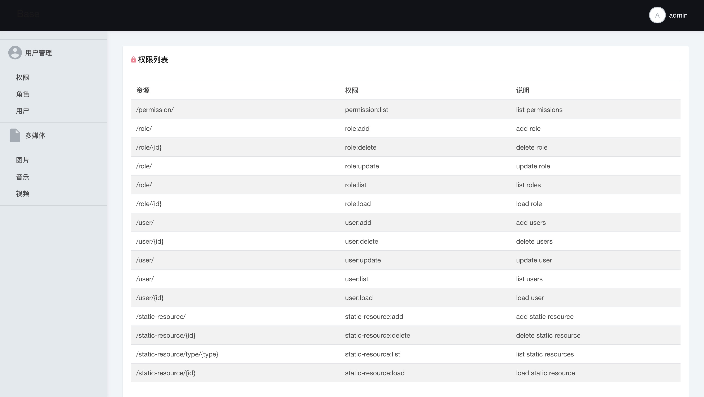
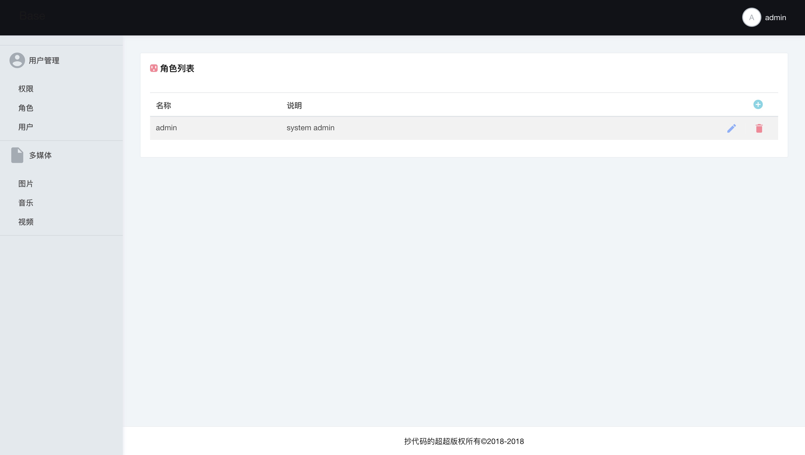
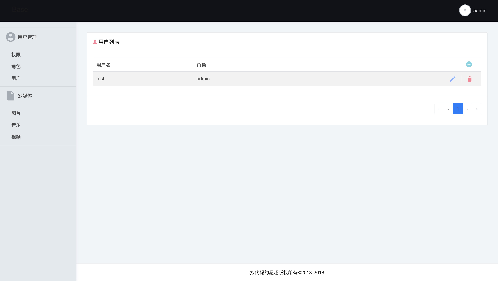

# 介绍

这个项目整体上为一个`Web`项目的基础部分，分为`前台` 和`后台`两个部分。前台项目是由`Angular`编写，后台项目由`SpringBoot`及其它组件编写，主要分为两个服务：`service-web`是`Web`服务，为前台项目提供接口，处理业务流程，实现了基于权限、角色、用户的基本系统；`service-static-resource`是一个基本的静态资源服务，根据请求参数压缩图片的分辨率，提供音视频转码和`mpeg-dash`格式的流媒体服务。


# 目录结构

```shell
├── app
├── env
│   └── dev
├── server
│   ├── ffmpeg
│   │   ├── linux-x86_64
│   │   ├── macos-x86_64
│   │   └── windows-x86_64
│   ├── lib-commons
│   ├── lib-dao
│   ├── lib-model
│   ├── lib-service
│   ├── lib-static-resource
│   ├── service-static-resource
│   └── service-web
└── web
```


# 安装

## 依赖软件

`JDK8` ，地址：http://www.oracle.com/technetwork/java/javase/downloads/jdk8-downloads-2133151.html

`vagrant`，地址：https://www.vagrantup.com/

`virtual box`，地址：https://www.virtualbox.org/wiki/Downloads

 `nodejs` ，地址：https://nodejs.org/zh-cn/

## IDE

`Eclipse`推荐使用`STS`，地址：https://spring.io/tools/sts

`WebStorm`，地址：https://www.jetbrains.com/webstorm/

### 启动服务

```shell
cd Base/env/dev/
vagrant up
```

`vagrant`启动后会在它管理的linux镜像中部署好`mysql`和`rabbitmq`。`mysql`默认为`base`，密码为`123456`。`rabbitmq`用户为`root`，密码为`123456`。

### 导入后台项目

打开`Eclipse`，导入`Base/server`为`maven`项目。

### 导入前台

打开`WebStorm`，打开`Base/web`，然后在这个目录下使用`npm install`安装依赖库。

### 运行后台

以`Java Application ` 运行`service-web`中的`ServiceStaticResourceApplication.java`

以`Java Application ` 运行`service-static-resource`中的`ServiceWebApplication.java`

### 运行前台

```shell
npm start
```

默认用户：admin/123456


# 界面

## 登录



## 用户管理

### 权限列表



###角色列表



###角色修改


###用户列表



## 多媒体

### 图片


### 音乐


### 视频


### Swagger Api

